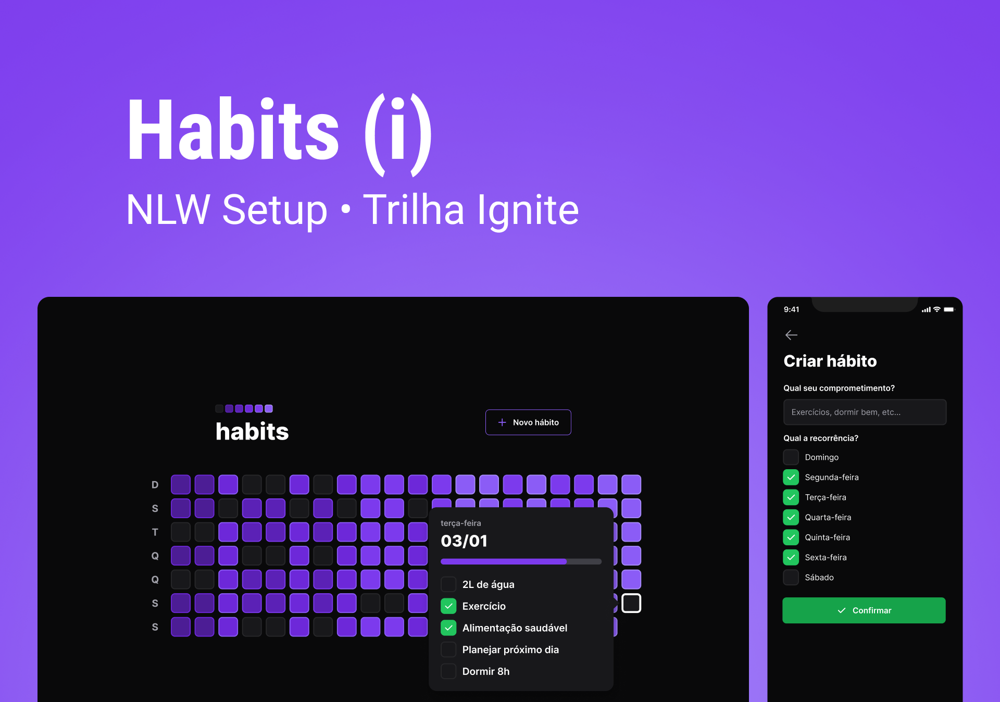

  

<h1 align="center">Next Level Week 11 - Trilha Ignite</h1>

  

  <a href="https://www.codacy.com/gh/MateusJSouza/Habits-NLW/dashboard?utm_source=github.com&amp;utm_medium=referral&amp;utm_content=MateusJSouza/Habits-NLW&amp;utm_campaign=Badge_Grade">
  
  
  
  
  

---

<h4 align="center">
  This is a project developed during the Next Level Week of the Rocketseat platform.
</h4>

  

---

## 🚴🏽 Project

An application to track your habits, where you can create, view and complete habits throughout the day.

You can view the project online right [here](https://habits-nlw.vercel.app/).

## 🔧 Technologies
This project was developed by me the following technologies:

- [Vite](https://vitejs.dev/)
- [ReactJS](https://reactjs.org/)
- [Typescript](https://www.typescriptlang.org/)
- [React Native](https://reactnative.dev/)
- [NodeJS](https://nodejs.org/pt-br/)
- [Expo](https://expo.dev/)
- [Prisma](https://www.prisma.io/)
- [TailwindCSS](https://tailwindcss.com/)

---

👉🏽 Access my portfolio [here](https://mateusj-portfolio.vercel.app/).

Made with 💜 by Mateus Jesus

  

